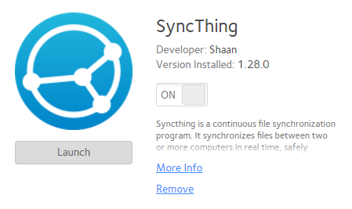

## SyncThing Package for ReadyNAS 6

Config package to setup SyncThing on the armv7 based ReadyNAS systems.

- Copy the contents of ./apps/ to /apps/ on ReadyNAS. E.g. `rsync -av ./apps/ root@readynas.local:/apps/`
- SSH into ReadyNAS system. E.g. `ssh root@readynas.local`
- Exec: `/frontview/bin/fvapps` and `systemctl restart apache2` to make ReadyNAS copy and pick up the new service definitions.
- Exec: `cd /apps/syncthing && chmod +x ./install.sh`
- SyncThing service should be ready at this point.
    - Pick an user to run the service under. It can be the primary personalized user (not root, neither admin), e.g. `johndoe`.
    - Start service instance for the user `systemctl start syncthing@johndoe`.
    - Reconfigure it to run GUI on all interfaces `IP=0.0.0.0 sed -i 's~\(<address>\)[^>]*\(:8384</address>\)~\1$IP\2~g' /home/johndoe/.local/state/syncthing/config.xml` assuming ReadyNAS is running inside a private network. If it is exposed to public network, then modify `0.0.0.0` in above command accordingly.
    - Restart the service `systemctl restart syncthing@johndoe`
- Access the GUI web interface at `http://<readynas-ip/host>:8384/`